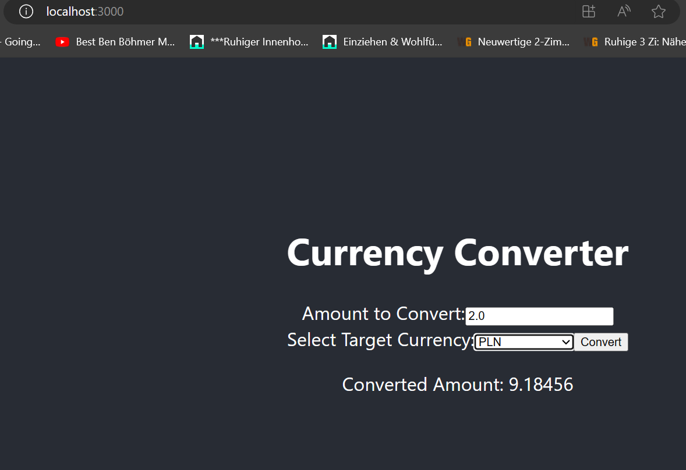

## Simple Currency Converter API

The Api has two endpoints:
* First one: **_POST_** http://localhost:8080/convert, to convert an amount of the EUR currency to one of the currencies presented by their rates here: http://localhost:9090/currencies.
* Second one: **_GET_** http://localhost:8080/currencies, to get currencies full names.

Feel free to run the API and consume it from either Postman (using this collection for example: [currencyconversion.postman_collection.json](currencyconversion.postman_collection.json) or another client that has 3000 as port.

Here is a link of my GitHub account to the client I have already implemented: https://github.com/Anouar1611/currency-converter-front.

Some results from this client:

- Integrated Automated test using Selenium.