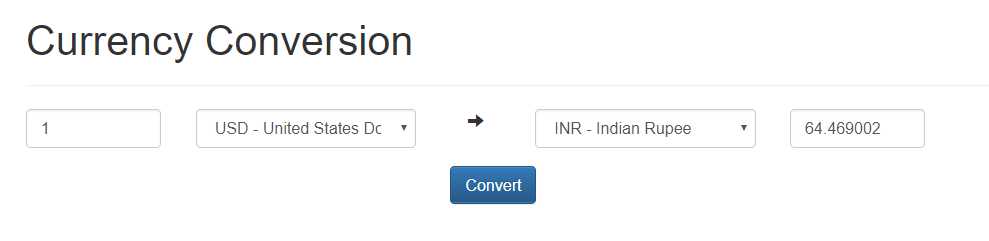

# Create a currency converter

## Your task

### 1. Currency converter

You have a basic spring-boot application. You can open the web interface using: http://localhost:8080/

Please create a currency converter website which will have input fields for amount and from/to currency selection you. The website should look like the mockup above.

The website does not have to be beautiful, but it must be functional.

* The inputs should only allow numbers and comma. The values have 2 decimal places and are separated by commas.
* You can fetch the symbols and latest rates from this API: http://api.exchangeratesapi.io/v1/latest?access_key=83d85a4f7f2a437cb52bfa98a7d51dfd
* Please use this endpoint, we expect you to implement conversion based on latest rates yourself.

### 2. Currencies full names

* Replace the currency abbreviations with their full names. For this purpose you can use the REST API at https://openexchangerates.org/api/currencies.json
* HINT: match only the currencies you got from point 1.
* Sort the currencies full names alphabetically.

### Additional points to remember:
* Design your own currency conversion API that is accepting client input and returns the converted value
* Nice to have: as the exchange rates API has a usage limit, use caching in your app to limit the number of exchange-rates API calls
* We really love tests, and it would be nice if we can see some tests from you :)